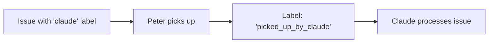
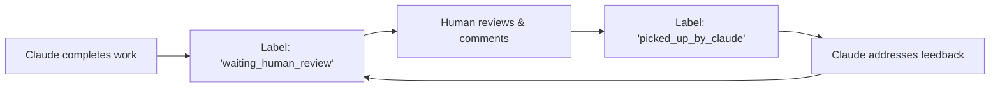

# Peter - GitLab Issue Automation with Claude AI

Peter is a powerful daemon that automates GitLab issue processing using Claude AI. It monitors GitLab issues with specific labels and automatically creates implementation plans, code changes, and merge requests.

## 🚀 Quick Start

### Installation

Install Peter directly from GitHub using Go:

```bash
go install github.com/your-username/peter@latest
```

> **Note**: Replace `your-username` with the actual GitHub username/organization where this repository is hosted.

### Prerequisites

1. **Go 1.19+** - [Install Go](https://golang.org/doc/install)
2. **Claude CLI** - [Install Claude](https://docs.anthropic.com/en/docs/claude-code)
3. **GitLab Account** with API access
4. **GitLab Personal Access Token** with appropriate permissions

### Required GitLab Token Permissions

Your GitLab Personal Access Token needs the following scopes:
- `api` - Full access to the API
- `read_user` - Read user information
- `read_repository` - Read repository data
- `write_repository` - Write repository data (for creating branches, commits)

## 📋 Configuration

### 1. Create Configuration File

Create a `peter.yaml` file in your project directory:

```yaml
gitlab:
  url: "https://gitlab.com"  # or your GitLab instance URL
  token: "glpat-your-token-here"
  username: "your-gitlab-username"

claude:
  command: "claude"
  flags: "--dangerously-skip-permissions --output-format stream-json --verbose"

projects:
  default_path: ""  # Will be set via interactive mode

daemon:
  interval: 10  # Check for new issues every 10 seconds
  claude_label: "claude"
  process_label: "picked_up_by_claude"
  review_label: "waiting_human_review"
```

### 2. Environment Variables (Alternative)

You can also use environment variables instead of the YAML file:

```bash
export GITLAB_URL="https://gitlab.com"
export GITLAB_TOKEN="glpat-your-token-here"
export GITLAB_USERNAME="your-gitlab-username"
export CLAUDE_COMMAND="claude"
export CLAUDE_FLAGS="--dangerously-skip-permissions --output-format stream-json --verbose"
```

## 🎯 Usage Modes

### Interactive Setup

First, set up your project interactively:

```bash
peter -interactive
```

This will:
1. List your accessible GitLab projects
2. Let you select a project to monitor
3. Save the selection to `peter.yaml`
4. Optionally process an issue immediately

### Daemon Mode (Recommended)

#### With Memory (SQLite Session Storage)
```bash
peter --daemon --memory
```

**Features:**
- Persistent session storage
- Automatic session resumption when humans comment
- Full conversation history maintained
- Ideal for complex, ongoing issues

#### Without Memory (Fresh Sessions)
```bash
peter --daemon
```

**Features:**
- Each issue gets a fresh Claude session
- No session persistence
- Claude reads all existing comments for context
- Simpler architecture, easier debugging
- Repository state preserved between sessions

### Single Issue Processing

```bash
# Process a specific issue
peter -issue 123

# Dry run (see what would happen)
peter -issue 123 -dry-run

# Semi-dry run (clone repo, show prompt, but don't execute)
peter -issue 123 -semi-dry-run
```

### Utility Commands

```bash
# List accessible projects
peter -list-projects

# Search for projects
peter -search "backend"

# List issues in selected project
peter -list-issues

# List issues with specific label
peter -list-issues -label "claude"

# Test label filtering
peter -test-labels

# Debug GitLab MCP integration
peter -debug-mcp
```

## 🏷️ Label Workflow

Peter uses a three-label workflow system:

### 1. Starting Work: `claude` Label



**To start:** Add the `claude` label to any GitLab issue.

### 2. Processing: `picked_up_by_claude` Label

While Peter is processing:
- Issue is labeled `picked_up_by_claude`
- Claude analyzes the issue and existing comments
- Creates implementation plan and posts as comment
- Implements the solution
- Creates merge request
- Updates issue with completion status

### 3. Human Review: `waiting_human_review` Label



After Claude completes:
- Issue is labeled `waiting_human_review`
- Humans review the merge request and implementation
- Add comments with feedback, questions, or requests
- Peter automatically detects human comments and re-engages Claude

### 4. Completion: `solved` Label

When satisfied with the implementation:
- Manually change label to `solved`
- Or remove all workflow labels
- This stops the automation loop

## 🔧 Advanced Configuration

### Custom Claude Flags

Modify the `claude.flags` in your configuration:

```yaml
claude:
  flags: "--dangerously-skip-permissions --output-format stream-json --verbose --model claude-3-5-sonnet-20241022"
```

### Different Polling Intervals

```yaml
daemon:
  interval: 30  # Check every 30 seconds instead of 10
```

### Custom Label Names

```yaml
daemon:
  claude_label: "ai-help"           # Instead of "claude"
  process_label: "ai-working"       # Instead of "picked_up_by_claude"
  review_label: "human-review"      # Instead of "waiting_human_review"
```

## 📁 Project Structure

```
your-project/
├── peter.yaml          # Configuration file
├── .env               # Optional environment variables
└── .git/              # Git repository (will be auto-cloned if needed)
```

## 🐛 Troubleshooting

### Common Issues

**1. "GitLab connection test failed"**
```bash
# Check your token and URL
peter -list-projects
```

**2. "No project configured"**
```bash
# Run interactive setup
peter -interactive
```

**3. "Claude command not found"**
```bash
# Install Claude CLI
# See: https://docs.anthropic.com/en/docs/claude-code
which claude
```

**4. "Permission denied" errors**
- Check GitLab token permissions
- Ensure token has `api` and `write_repository` scopes

### Debug Mode

Use dry-run modes to debug issues:

```bash
# See exactly what would happen
peter --daemon -dry-run

# Clone repo and show prompts without executing
peter --daemon -semi-dry-run
```

### Logs and Monitoring

Peter provides detailed logging:

```bash
# Run daemon with full debug output
peter --daemon 2>&1 | tee peter.log
```

## 🔄 Workflow Examples

### Example 1: New Feature Request

1. **Human creates issue**: "Add dark mode toggle to settings page"
2. **Human adds label**: `claude`
3. **Peter picks up**: Changes label to `picked_up_by_claude`
4. **Claude analyzes**: Reads issue description and existing comments
5. **Claude plans**: Posts implementation plan as comment
6. **Claude implements**: Creates branch, writes code, commits changes
7. **Claude delivers**: Creates merge request, updates issue
8. **System updates**: Label changes to `waiting_human_review`
9. **Human reviews**: Checks MR, tests locally, adds feedback comment
10. **Peter re-engages**: Detects human comment, changes label back to `picked_up_by_claude`
11. **Claude iterates**: Addresses feedback, updates implementation
12. **Loop continues**: Until human is satisfied and marks as `solved`

### Example 2: Bug Fix

1. **Issue**: "Login form doesn't validate email addresses properly"
2. **Add label**: `claude`
3. **Claude**: Investigates code, identifies validation logic issue
4. **Claude**: Posts analysis and fix plan as comment
5. **Claude**: Implements fix, adds tests, creates MR
6. **Human**: Reviews, requests additional test cases
7. **Claude**: Adds more comprehensive tests
8. **Human**: Approves and merges, marks `solved`

## 🚀 Best Practices

### Issue Description Quality

Write clear, detailed issue descriptions:

```markdown
## Problem
The user login form accepts invalid email addresses like "user@" or "user.com"

## Expected Behavior
Only valid email addresses should be accepted (user@domain.com format)

## Acceptance Criteria
- [ ] Email validation follows RFC 5322 standard
- [ ] Clear error messages for invalid emails
- [ ] Unit tests cover edge cases
- [ ] Integration tests verify form behavior
```

### Effective Human Feedback

When reviewing Claude's work:

```markdown
## Code Review Feedback

✅ **Good:**
- Implementation logic is correct
- Tests cover main scenarios

🔄 **Needs Changes:**
- Please add validation for edge case: empty domain
- Error message should be more user-friendly
- Add test for maximum email length (320 chars)

## Questions
- Should we support internationalized domain names?
- What about plus addressing (user+tag@domain.com)?
```

### Repository Management

- Keep your repositories clean and up-to-date
- Use meaningful branch names (Peter creates `issue-{number}` branches)
- Review and merge Peter's MRs promptly to avoid conflicts

## 🔒 Security Considerations

- Store GitLab tokens securely (use environment variables in production)
- Review all code changes before merging
- Use appropriate GitLab project permissions
- Consider running Peter in a isolated environment for production use

## 📚 Additional Resources

- [Claude Code Documentation](https://docs.anthropic.com/en/docs/claude-code)
- [GitLab API Documentation](https://docs.gitlab.com/ee/api/)
- [Peter GitHub Repository](https://github.com/your-username/peter)

## 🤝 Contributing

Contributions are welcome! Please see [CONTRIBUTING.md](CONTRIBUTING.md) for guidelines.

## 📄 License

This project is licensed under the MIT License - see the [LICENSE](LICENSE) file for details.